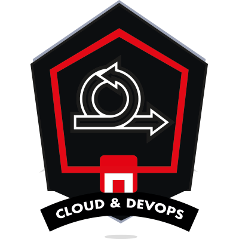
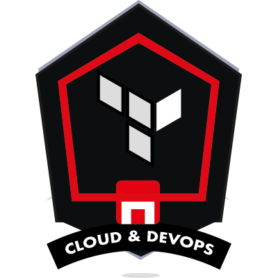
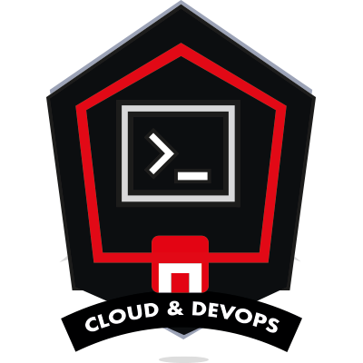

## 👋 Hi, I’m Renzo
This repository is my digital corner where I develop and hone my skills as a cloud engineer.
I am committed to constant learning and continuous improvement, and this space reflects my journey in the exciting world of the cloud.

## 🛠️ These are the tools I work with:

## 📊 My GitHub stats:

 

## ✨ Skills
<table style="border: 0px;">
    <tr>
        <td></td>
        <td></td>
        <td></td>
        <td></td>
    </tr>
    <tr>
        <td></td>
        <td></td>
        <td></td>
        <td></td>
    </tr>
</table>

## ⚡Connect to view

